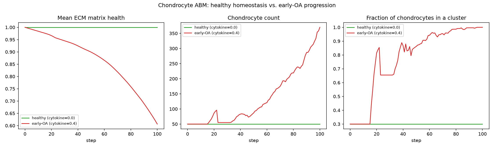
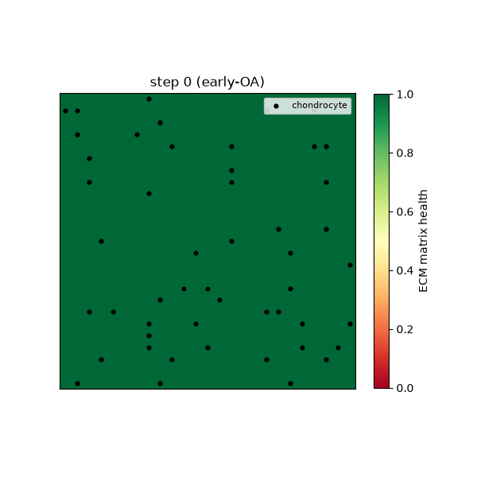

# Agent-Based Modelling: Chondrocyte Cluster Formation in Osteoarthritis

A [Mesa](https://mesa.readthedocs.io/)-based agent-based model (ABM) of chondrocytes (cartilage
cells) maintaining -- or failing to maintain -- their surrounding extracellular matrix (ECM),
comparing a healthy/physiological condition against an early-osteoarthritis (OA) inflammatory
condition.

## Background

An original model, built from scratch: a Mesa grid, agents whose local interactions cause
spontaneous clustering, and a metric-driven comparison between two conditions.

The biology here is grounded in real chondrocyte/osteoarthritis literature (see
[Model design](#model-design--literature) below) rather than invented from scratch or copied
from an existing implementation -- there's no public "chondrocyte ABM + dataset" that this
reimplements; the specific parameter values are illustrative, not fitted to experimental assay
data (see [Parameters](#parameters-are-illustrative)).

## The model

Chondrocytes sit in lacunae within the ECM they maintain. Each grid cell holds an ECM "matrix
health" value in `[0, 1]` (1 = fully healthy). Each step, every living chondrocyte:

1. **Senses a catabolic (matrix-degrading) drive**, combining an ambient inflammatory cytokine
   level (representing, e.g., elevated IL-1beta/TNF-alpha in OA synovial fluid) with the amount
   of damage already present in its own lacuna -- damaged matrix contributes to further catabolic
   signaling, a simplified stand-in for the DAMP/cytokine feedback loop described in
   Segarra-Queralt et al. 2023 (below).
2. **Either synthesizes or degrades** its local matrix depending on whether that catabolic drive
   crosses a threshold -- an anabolic/catabolic switch, again following the same source.
3. **May proliferate** into a neighboring damaged lacuna, forming a cell cluster. This is
   "chondrocyte cloning" -- a well-documented histological hallmark of early OA cartilage, where
   chondrocytes attempt (and, per the disease's natural history, generally fail) to repair
   localized matrix damage by proliferating near it.
4. **May undergo apoptosis** once its accumulated exposure to catabolic signaling gets too high.

Two conditions are meant to be compared:

| Condition | `cytokine_level` | What happens |
|---|---|---|
| Healthy | `0.0` | Stays at homeostasis indefinitely -- matrix health pinned at 1.0, no clustering beyond the incidental baseline from random initial placement. |
| Early-OA | `0.4` | Catabolic activity starts immediately, matrix health declines progressively, chondrocytes proliferate into damaged neighborhoods (cluster fraction climbs toward 1.0) -- a repair response that here does not keep pace with degradation, matching real OA's progressive course. |

### Example output

`python examples/run_comparison.py`:



`python examples/animate.py` (matrix health heatmap + chondrocyte positions over 100 steps of
the early-OA condition):



## Model design & literature

- Segarra-Queralt, M., Piella, G., & Noailly, J. (2023). [Network-based modelling of
  mechano-inflammatory chondrocyte regulation in early osteoarthritis](
  https://pmc.ncbi.nlm.nih.gov/articles/PMC9936426/). *Frontiers in Bioengineering and
  Biotechnology.* -- source for the mechano-inflammatory catabolic/anabolic switch and the
  matrix-damage feedback signal.
- Mukherjee, S., Lesage, R., et al. (2025). [A multiscale modeling approach to study the role of
  mechanics and inflammation in pathophysiology of articular cartilage](
  https://www.biorxiv.org/content/10.64898/2025.12.29.696945v1). *bioRxiv preprint.* -- multiscale
  tissue/cell-mechanics-to-gene-network context for how mechanical loading and inflammation
  jointly drive chondrocyte behavior.
- Chondrocyte cluster formation ("cloning") in early OA cartilage is well established in the
  cartilage histopathology literature as a proliferative repair response to localized matrix
  damage.

### Parameters are illustrative

`CartilageModel`'s rate constants (`degradation_rate`, `synthesis_rate`, `proliferation_prob`,
`apoptosis_threshold`, etc.) were hand-tuned so the two conditions produce a clear, legible
divergence over a ~100-step simulation -- they are **not** fitted to any real assay or clinical
dataset. Treat this as a qualitative, pedagogical model of the mechanism (matrix damage -> more
catabolic signaling -> more damage -> reactive-but-insufficient clustering), not a quantitative
predictor.

## Installation

```bash
python -m venv .venv && source .venv/bin/activate
pip install -r requirements.txt
```

## Usage

```bash
python examples/run_comparison.py   # healthy vs early-OA metrics over time -> healthy_vs_oa.png
python examples/animate.py          # animated heatmap of one early-OA run -> oa_progression.gif
```

```python
from cartilage import CartilageModel, HEALTHY_CYTOKINE_LEVEL, EARLY_OA_CYTOKINE_LEVEL

model = CartilageModel(width=25, height=25, num_chondrocytes=50,
                        cytokine_level=EARLY_OA_CYTOKINE_LEVEL, seed=42)
for _ in range(100):
    model.step()

df = model.datacollector.get_model_vars_dataframe()
print(df[["MeanMatrixHealth", "NumChondrocytes", "ClusterFraction"]])
```

## Testing

```bash
pip install -r requirements-dev.txt
pytest tests/ -v
```

9 tests covering model initialization, the healthy-condition homeostasis invariant, the
early-OA progressive-decline and clustering behavior, matrix value bounds, apoptosis/proliferation
mechanics, and run-to-run reproducibility under a fixed seed.

## Project structure

```
.
├── cartilage/
│   ├── __init__.py
│   ├── agents.py      # Chondrocyte: catabolic/anabolic switch, proliferation, apoptosis
│   └── model.py        # CartilageModel: the ECM grid + DataCollector reporters
├── examples/
│   ├── run_comparison.py   # healthy vs early-OA metrics plot
│   └── animate.py           # animated heatmap of one run
├── tests/test_model.py
├── requirements.txt
├── requirements-dev.txt
└── conftest.py
```

## License

[MIT](LICENSE.txt)
